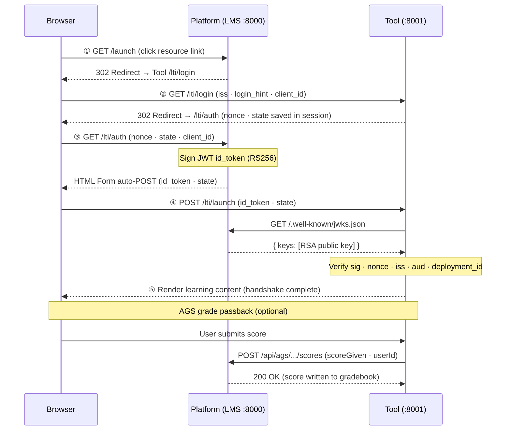

# LTI 1.3 Demo

A minimal, runnable LTI 1.3 implementation in Python / Flask — one **Platform (LMS)** and one **Tool** that complete the full OIDC handshake, grade passback (AGS), and roster fetch (NRPS).

> 中文文档见 [README_zh.md](./README_zh.md)

---

## What's Inside

| File | Role |
|---|---|
| `keygen.py` | Generate RSA-2048 keypair for the Platform |
| `lms.py` | Platform (LMS) — port 8000 |
| `tool.py` | Tool (external learning app) — port 8001 |
| `requirements.txt` | Python dependencies |

---

## Quick Start

### 1. Prerequisites

- Python 3.10+
- pip

### 2. Install dependencies

```bash
pip install -r requirements.txt
```

### 3. Generate the RSA keypair

Run this **once** before starting the servers. It writes `platform_private.pem` and `platform_jwks.json` to the current directory.

```bash
python keygen.py
```

### 4. Start the Platform (LMS)

Open a terminal in the project directory:

```bash
python lms.py
```

Platform runs at **http://localhost:8000**

### 5. Start the Tool

Open a **second** terminal in the same directory:

```bash
python tool.py
```

Tool runs at **http://localhost:8001**

### 6. Try the LTI launch

1. Open **http://localhost:8000** in your browser
2. Click **"Week 3 - 编程练习"** (Learner role) or **"Week 3 - 编程练习（教师视图）"** (Instructor role)
3. The browser completes the 5-step LTI 1.3 OIDC handshake automatically
4. The Tool page renders with the decoded JWT claims
5. Click **"提交成绩"** to test AGS grade passback — the Platform gradebook at http://localhost:8000 updates in real time

---

## LTI 1.3 Flow



---

## Key Design Points

- **No framework magic** — raw Flask routes, raw PyJWT. Every LTI step is explicit and readable.
- **Security checks in order**: state (CSRF) → JWT signature → iss/aud/exp → nonce (replay) → deployment_id
- **AGS grade passback**: Tool POSTs to `{lineitem}/scores` with `application/vnd.ims.lis.v1.score+json`
- **NRPS roster**: Instructor view fetches course membership via the NRPS endpoint

> **Note:** `platform.py` is intentionally named `lms.py`. Python's stdlib has a `platform` module; Flask/Werkzeug imports it internally, causing a circular import if your file is named `platform.py`.

---

## License

MIT
