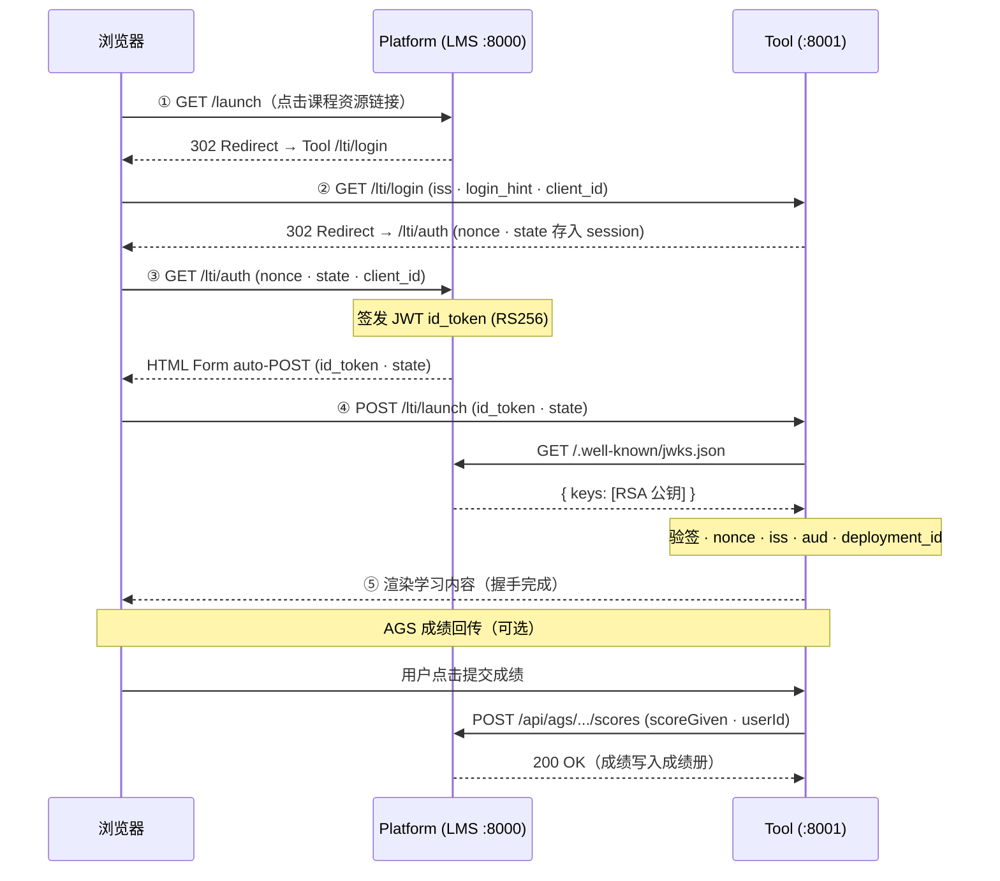

# LTI 1.3 Demo

最小可运行的 LTI 1.3 Python / Flask 实现，包含完整的 **Platform（LMS）** 和 **Tool（外部学习工具）**，覆盖 OIDC 握手、成绩回传（AGS）和花名册拉取（NRPS）全流程。

> English documentation: [README.md](./README.md)

---

## 文件说明

| 文件 | 作用 |
|---|---|
| `keygen.py` | 生成 Platform 所需的 RSA-2048 密钥对 |
| `lms.py` | Platform（LMS 端）— 端口 8000 |
| `tool.py` | Tool（外部学习工具端）— 端口 8001 |
| `requirements.txt` | Python 依赖列表 |

---

## 快速开始

### 1. 环境要求

- Python 3.10+
- pip

### 2. 安装依赖

```bash
pip install -r requirements.txt
```

### 3. 生成 RSA 密钥对

首次运行前执行一次，会在当前目录生成 `platform_private.pem` 和 `platform_jwks.json`：

```bash
python keygen.py
```

### 4. 启动 Platform（LMS）

在项目目录打开一个终端：

```bash
python lms.py
```

Platform 运行于 **http://localhost:8000**

### 5. 启动 Tool

再打开**第二个**终端，进入同一目录：

```bash
python tool.py
```

Tool 运行于 **http://localhost:8001**

### 6. 体验 LTI 启动流程

1. 浏览器打开 **http://localhost:8000**
2. 点击 **"Week 3 - 编程练习"**（学生角色）或 **"Week 3 - 编程练习（教师视图）"**（教师角色）
3. 浏览器自动完成 5 步 LTI 1.3 OIDC 握手
4. Tool 页面展示解析后的 JWT claims
5. 点击 **"提交成绩"** 测试 AGS 成绩回传 —— 刷新 http://localhost:8000 可看到成绩册更新

---

## LTI 1.3 交互流程



---

## 设计要点

- **零框架魔法** — 原生 Flask 路由 + 原生 PyJWT，每一步 LTI 流程都显式可读
- **安全检查顺序**：state（防 CSRF）→ JWT 签名 → iss/aud/exp → nonce（防重放）→ deployment_id
- **AGS 成绩回传**：Tool 以 `application/vnd.ims.lis.v1.score+json` 格式 POST 到 `{lineitem}/scores`
- **NRPS 花名册**：教师视图通过 NRPS 端点拉取课程成员列表

> **注意**：Platform 文件故意命名为 `lms.py` 而非 `platform.py`。Python 标准库中存在 `platform` 模块，Flask/Werkzeug 内部会 `import platform`，如果当前目录有同名文件会触发循环导入报错。

---

## License

MIT
